# WorkSphere

> An employee management platform built with React, Express, MongoDB, Docker, and CI, with a roadmap for microservices, Terraform, and AWS.

WorkSphere is a full-stack employee management platform designed to demonstrate production-oriented software engineering practices. The current application combines a React frontend, a modular Node.js/Express API, MongoDB persistence, authentication and authorization, containerized local development, automated CI, and application logging. Independently deployable microservices, automated cloud deployment, and AWS infrastructure are planned.

---

## Run the implemented application

The current implementation is a React app in `frontend/` and a modular Express API in
`backend/`. The microservice layout later in this document remains a roadmap.
Registration, login, session refresh, logout, protected dashboard, and role-scoped
employee CRUD are implemented.

Use Node.js **26.10.0**, selected because both its Debian and Alpine Docker images
are published.
The root `.nvmrc` pins the local and CI runtime; both Dockerfiles use the same
version. If you use nvm, run `nvm install` and `nvm use` from the repository root
before installing dependencies.

```sh
cd backend
npm ci
cp .env.example .env
# Set JWT_ACCESS_SECRET to a random secret (at least 32 characters).
# Generate one with: node -e "console.log(require('crypto').randomBytes(48).toString('hex'))"
npm start
```

Start MongoDB locally on port 27017, or set `MONGO_URI` in `backend/.env`.
In another terminal:

```sh
cd frontend
npm ci
cp .env.example .env
npm start
```

Open http://localhost:3000. Alternatively, after configuring `backend/.env`, run
`docker compose up --build` from the repository root to start MongoDB, API, and web.
The compose configuration is for local development.

### Current source layout

```text
frontend/src/
  api/                 shared HTTP client and session refresh
  features/auth/       forms and authentication state
  features/dashboard/  account overview
  features/employees/  scoped employee directory and editing
  layouts/             authenticated navigation
  styles/              responsive application styles
backend/src/
  config/              environment validation
  controllers/         auth and employee request handlers
  middleware/          authentication and authorization
  migrations/          explicit MongoDB data migrations
  models/              Account, Session, Employee
  routes/              versioned auth and employee endpoints
  services/            employee domain, validation, and session lifecycle
  utils/               application errors and structured logging
backend/tests/         API integration tests with ephemeral MongoDB
backend/scripts/       standalone operational commands
```

### Accounts and permissions

Public registration always creates an `EMPLOYEE`; clients cannot select a role.
Registration does not create a session. It redirects to login with a success toast
and the email prefilled; users must sign in before accessing the dashboard.
Employees see only directory records matching their email. HR managers can read,
create, and edit employee records; admins can also delete them. Registration does
not automatically create an employee record. The existing `users` MongoDB
collection remains the employee directory, while `accounts` stores credentials.
Existing directory entries are **not** login accounts: register a new account.

Provision the first administrator by registering normally, then using `mongosh`
against the configured database:

```js
db.accounts.updateOne({ email: "your-normalized-email@example.com" }, { $set: { role: "ADMIN" } })
```

Reload the page after a role change. There is no public role-management endpoint.

### Migrating existing profile names

Accounts and employees use `firstName` and `lastName`. Existing lowercase records
and cached clients remain supported during the transition. Run the read-only audit
from `backend/` with `npm run migrate:names -- --dry-run`. The migration commands
are in `backend/scripts/migrate-names.js`. Deploy the API before the frontend and
retire old API writers before applying the migration. The implemented migration
subsystem audits both `accounts` and `users`; applying it backfills names, and
`--cleanup` additionally removes legacy fields and the old name index.

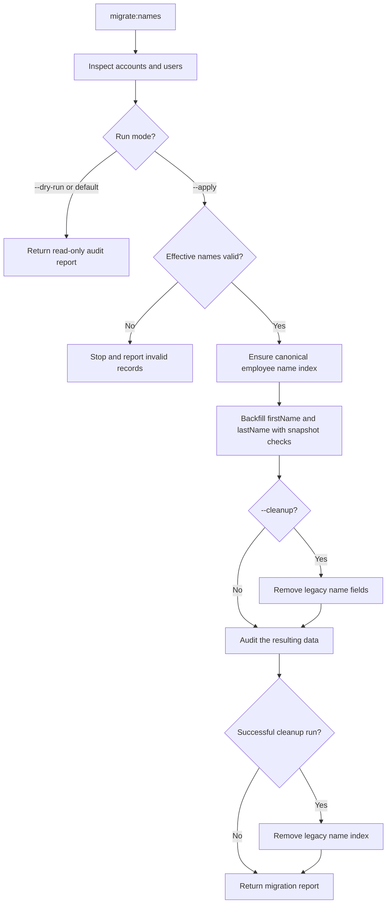

### Employee numbers

WorkSphere generates `employeeNumber` on creation, starting at `EMP-000001` in a
new database. The number is unique and immutable. Omit it from POST and PATCH
requests; supplying it returns a validation error. The employee form displays it
read-only, and employee responses, search, and sorting include it.

Existing numbers are preserved. To assign numbers to older records without one,
run `npm run migrate:employee-numbers -- --dry-run` from `backend/`.
`backend/scripts/migrate-employee-numbers.js` also accepts `--apply` to backfill
missing numbers and create the unique index. The persistent MongoDB counter
handles concurrent creates and never reuses deleted numbers. Failed creates can
leave gaps in the sequence. See [employee number allocation](#employee-number-allocation)
for the runtime subsystem.

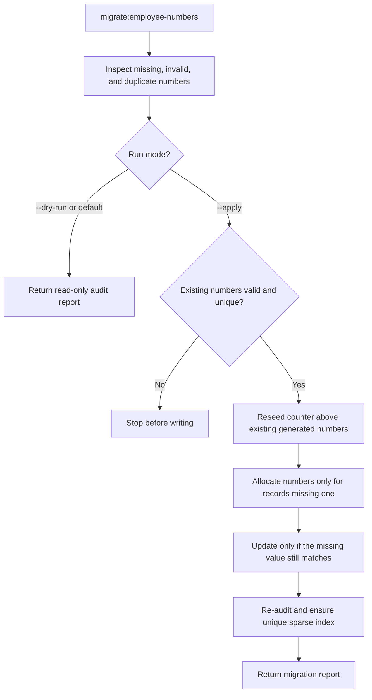

### Manager relationships

Employee create and update requests validate that `managerId` points to an
existing employee who is active or on leave. Self-management and reporting cycles
are rejected. Omit `managerId` to retain the current manager on PATCH; send
`managerId: null` to explicitly clear it.

Deleting a manager or setting their status to `INACTIVE` or `TERMINATED` returns
`409 MANAGER_HAS_DIRECT_REPORTS` while any employee still references them,
including inactive or terminated direct reports. HR or an admin must reassign
each report or explicitly clear its manager first. See the
[manager relationship policy](docs/manager-relationships.md) for API errors and
deployment scope.

### Session security and deployment

Passwords use bcrypt cost 12 with a 12-character minimum and 72-byte maximum.
Access JWTs expire after 15 minutes. Random refresh tokens expire after seven days,
are hashed in MongoDB, and rotate on use. Logout revokes the session immediately.
Tokens use HttpOnly, SameSite=Strict cookies and are never stored in localStorage.
Every mutation requires an exact `Origin` matching `CLIENT_ORIGIN`; scripts calling
these APIs must supply that header too. Login and registration share an IP rate
limit. Old `/auth/inventory` endpoints have been removed.

Production must use HTTPS, `NODE_ENV=production` (Secure cookies), a strong secret,
and web/API hosts on the same site. `REACT_APP_API_URL` includes `/api/v1` and is a
build-time setting. Configure proxy trust only for your known deployment topology;
the default deliberately trusts no forwarding headers. The in-memory rate limiter
is suitable for one API process; use a shared limiter store before scaling replicas.
Email verification, password recovery, and MFA are not implemented yet.

### Verify

```sh
cd backend && npm test
cd ../frontend && CI=true npm test -- --watchAll=false --runInBand
npm run build
```

Backend tests start an isolated MongoDB process with `mongodb-memory-server`; the
first run downloads a MongoDB binary. They never touch your application database.

---

## Table of Contents

- [Run the implemented application](#run-the-implemented-application)
- [Overview](#overview)
- [Why WorkSphere?](#why-worksphere)
- [Features](#features)
- [Architecture](#architecture)
  - [Diagram index](#diagram-index)
  - [Current application system](#current-application-system)
  - [Frontend system](#frontend-system)
  - [Backend API system](#backend-api-system)
  - [Target distributed system](#target-distributed-system)
- [Microservices](#microservices)
- [Technology Stack](#technology-stack)
- [Repository Structure](#repository-structure)
- [Domain Model](#domain-model)
- [API Design](#api-design)
- [Authentication and Authorization](#authentication-and-authorization)
- [Local Development](#local-development)
- [Docker](#docker)
- [Testing](#testing)
- [API Documentation](#api-documentation)
- [CI/CD](#cicd)
- [AWS Deployment Architecture](#aws-deployment-architecture)
- [Infrastructure as Code](#infrastructure-as-code)
- [Observability](#observability)
- [Security](#security)
- [Environment Variables](#environment-variables)
- [Development Roadmap](#development-roadmap)
- [Engineering Decisions](#engineering-decisions)
- [Future Improvements](#future-improvements)
- [Contributing](#contributing)
- [License](#license)

---

## Overview

WorkSphere provides a centralized platform for managing employees, organizational information, access control, and administrative activity.

The application is being refactored from an existing MERN CRUD application into a portfolio-ready distributed system with a clear separation of responsibilities between services.

The goal is to demonstrate practical experience with:

- Full-stack application development
- REST API design
- Microservice architecture
- Authentication and role-based authorization
- MongoDB data modeling
- Docker and containerized development
- Automated testing
- CI/CD pipelines
- AWS cloud architecture
- Infrastructure as Code with Terraform
- Logging, monitoring, and health checks
- Production-oriented security practices

---

## Why WorkSphere?

Many portfolio employee-management applications stop at CRUD operations. WorkSphere intentionally goes further.

The project is designed to answer engineering questions such as:

- How should authentication be separated from business-domain services?
- How can APIs enforce role-based permissions?
- How should independently deployable services own their data?
- How can a React application communicate with multiple backend services without coupling itself to their locations?
- How can services be containerized and tested consistently?
- How can deployments be automated?
- How should secrets and configuration be handled across environments?
- How can a distributed application be monitored in production?
- How can infrastructure be reproduced reliably?

The result is a project that can be discussed from frontend, backend, DevOps, cloud, and system-design perspectives.

---

## Features

### Employee Management

- Create employees
- View employee profiles
- Update employee information
- Delete or deactivate employees
- Search employees
- Filter employees
- Sort employee records
- Paginated employee directory
- Department assignment
- Employment status management
- Job-title management
- Manager relationships
- Employee hire-date tracking

### Authentication

- User registration
- Secure login
- Password hashing
- JWT access tokens
- Refresh tokens
- Logout
- Protected API routes
- Current-user endpoint
- Token validation

### Authorization

Implemented application roles:

| Role | Description |
| --- | --- |
| `ADMIN` | Full administrative access |
| `HR_MANAGER` | Manage employees and organizational information |
| `EMPLOYEE` | Read permitted employee/profile information |

Authorization is enforced by the backend rather than relying only on frontend route protection.

### Dashboard

The current dashboard shows the signed-in account and links to the employee
directory. A planned analytics subsystem will provide information such as:

- Total employees
- Active employees
- Employees by department
- Recent hires
- Employment-status distribution
- Recent administrative activity

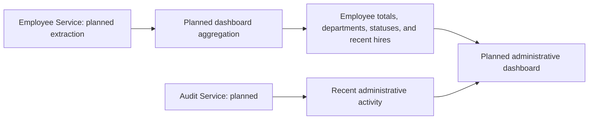

### Audit Trail

The planned Audit Service will record important administrative actions, including:

- Employee created
- Employee updated
- Employee deleted/deactivated
- Role changed
- Authentication/security events

Audit records identify the actor, action, target resource, timestamp, and relevant metadata.

---

## Architecture

The diagrams below describe both the implemented application and its roadmap.
**Current** diagrams follow the source in `frontend/`, `backend/`, and
`.github/workflows/`. **Planned** diagrams describe future service boundaries and
infrastructure. A subsystem is a module or workflow with a distinct responsibility;
individual functions and third-party dependencies appear inside its diagram.

### Diagram index

| System or subsystem | Status | Diagrams |
| --- | --- | --- |
| Application runtime | Current | [Application system](#current-application-system) |
| Frontend routing and layout | Current | [Frontend system](#frontend-system) |
| Authentication UI and state | Current | [Authentication interface](#authentication-interface) |
| Account dashboard | Current | [Account dashboard](#account-dashboard) |
| Directory, search, filters, sorting, and pagination | Current | [Employee directory interface](#employee-directory-interface) |
| Employee create/edit forms | Current | [Employee form subsystem](#employee-form-subsystem) |
| HTTP client and session recovery | Current | [Shared API client](#shared-api-client) |
| API request handling and response contract | Current | [Backend API system](#backend-api-system), [API design](#api-design) |
| Input validation and name compatibility | Current | [Validation and compatibility](#validation-and-compatibility) |
| Employee reads and writes | Current | [Employee domain subsystem](#employee-domain-subsystem) |
| Reporting relationships | Current | [Manager hierarchy](#manager-hierarchy) |
| Immutable employee numbers | Current | [Employee number allocation](#employee-number-allocation) |
| API errors and process lifecycle | Current | [Error handling](#error-handling-subsystem), [Server lifecycle](#server-lifecycle) |
| Accounts, sessions, employees, and counters | Current | [Domain model](#domain-model) |
| Identity, sessions, and permissions | Current | [Authentication and authorization](#authentication-and-authorization) |
| Data migrations | Current | [Name migration](#migrating-existing-profile-names), [Number migration](#employee-numbers) |
| Local startup and container builds | Current | [Local development](#local-development), [Docker](#docker) |
| Container builds, health, and HTTP smoke checks | Current | [Container verification](#container-verification) |
| Backend and frontend verification | Current | [Testing](#testing) |
| Browser workflows and role restrictions | Current | [End-to-end](#end-to-end) |
| CI workflows and future deployment | Current / planned | [CI/CD](#cicd) |
| Logs, request IDs, and health probes | Current / planned | [Observability](#observability) |
| Application security and configuration | Current / planned | [Security](#security), [Environment variables](#environment-variables) |
| Distributed runtime | Planned | [Target distributed system](#target-distributed-system) |
| Auth, Employee, Audit, and Gateway services | Planned | [Microservices](#microservices) |
| Dashboard analytics | Planned | [Dashboard](#dashboard) |
| API documentation | Planned | [API documentation](#api-documentation) |
| AWS and Terraform modules | Planned | [AWS deployment](#aws-deployment-architecture), [Infrastructure as code](#infrastructure-as-code) |
| Department, notifications, and event messaging | Future ideas | [Service extensions](#department-and-notification-services) |
| Profile media and CSV import/export | Future ideas | [Media and bulk data](#profile-media-and-bulk-data) |
| Cache, advanced analytics, and distributed tracing | Future ideas | [Caching, analytics, and tracing](#caching-analytics-and-tracing) |
| SSO, MFA, permissions, and data retention | Future ideas | [Identity and retention](#identity-and-retention-extensions) |
| Staging and blue/green deployments | Future ideas | [Deployment extensions](#staging-and-deployment-extensions) |

### Current application system

One Express process hosts the authentication and employee modules. All collections
share the configured MongoDB database. Browser requests go directly to the API;
the current Nginx configuration serves the frontend and its client-side routes.

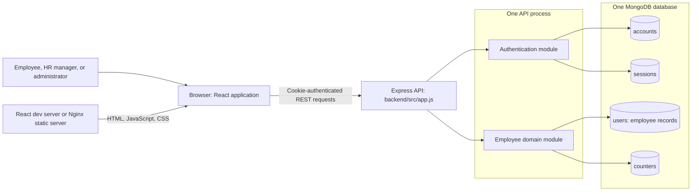

### Frontend system

`frontend/src/App.js` mounts the router and authentication provider. Route
protection waits for session initialization before rendering the shared layout.

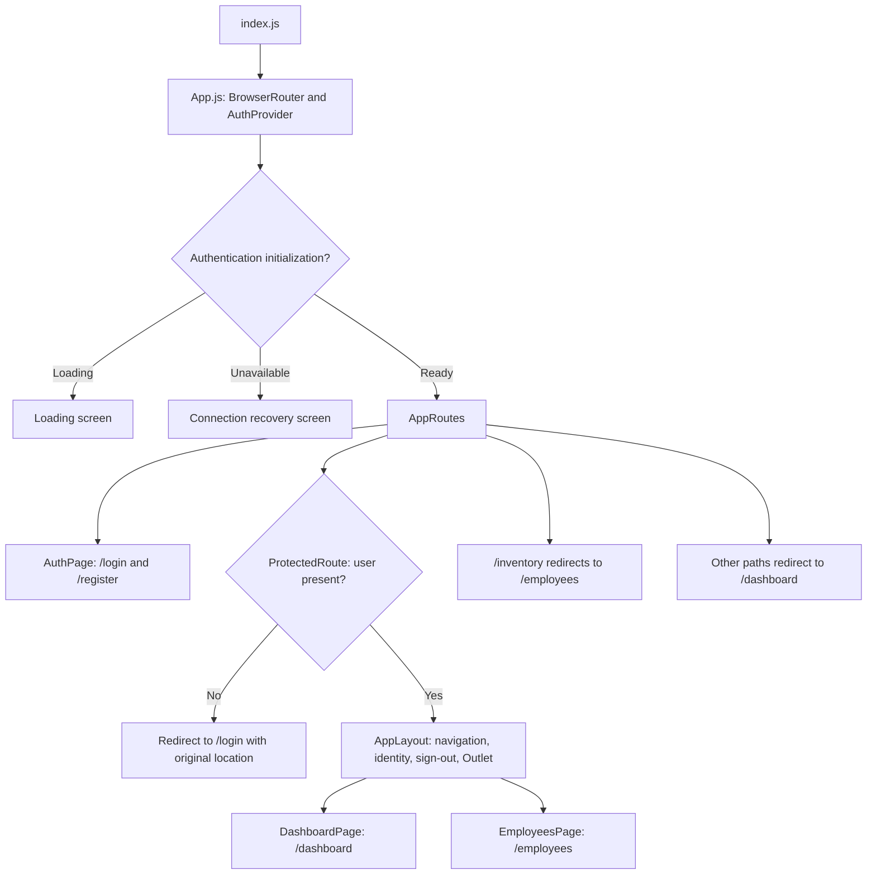

#### Authentication interface

`AuthPage` handles forms while `AuthContext` owns account state. Registration
returns the user to login; session initialization and expiration also update the
route guard.

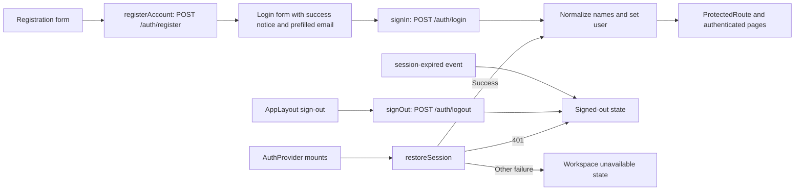

#### Account dashboard

The implemented dashboard reads authentication state; it does not request
aggregate employee statistics.

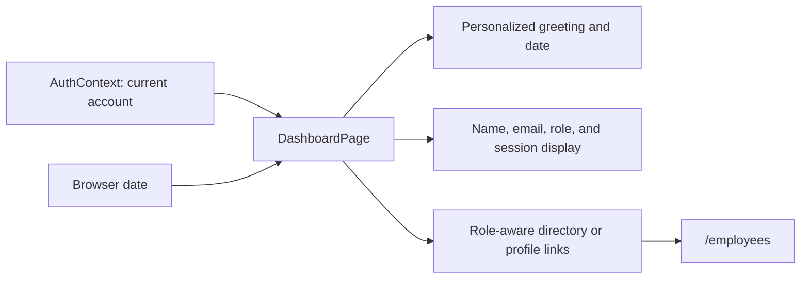

#### Employee directory interface

`EmployeesPage` owns query and view state. Management controls are visible to HR
and admins; the backend separately enforces all permissions and employee scope.

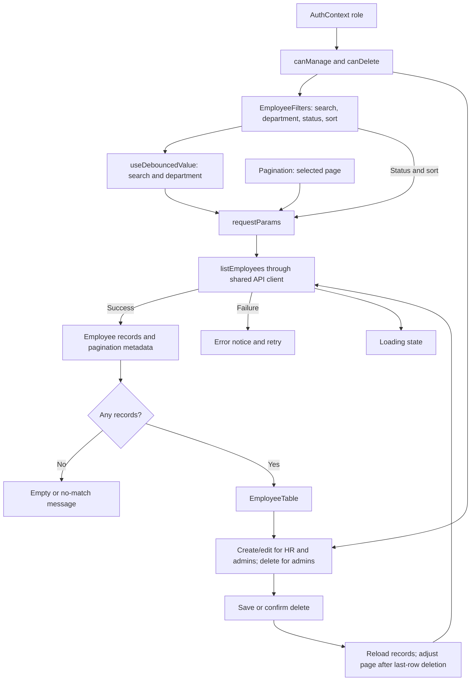

#### Employee form subsystem

The form edits profile fields and displays the employee number read-only.
Manager relationships are currently available through the API.

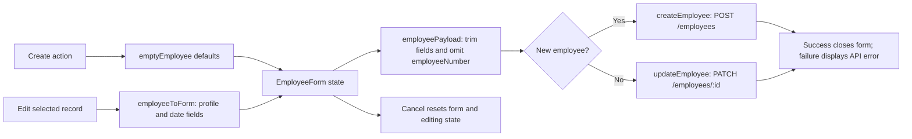

#### Shared API client

`frontend/src/api/client.js` sends credentials, shares one in-flight refresh
request, and retries an unauthorized request once. `authApi` handles login,
registration, refresh, and logout without the retry interceptor.

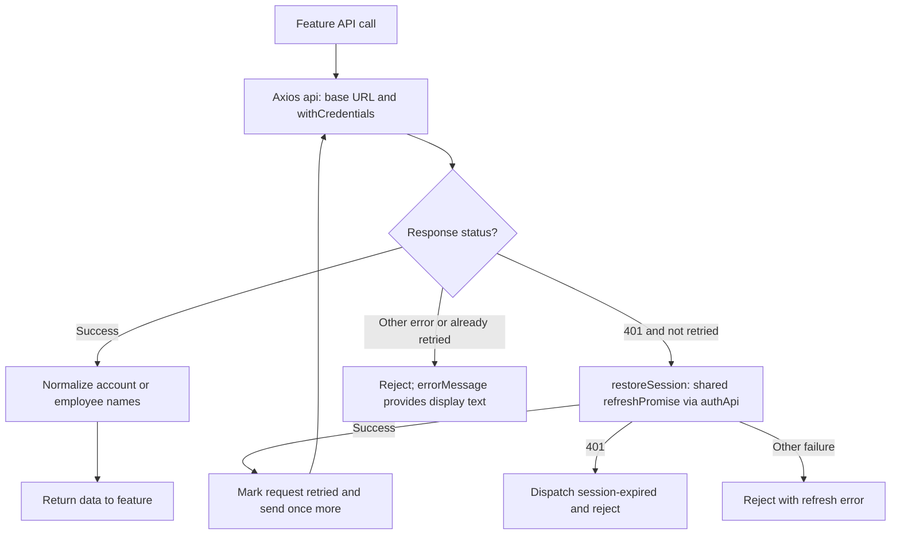

### Backend API system

`backend/src/app.js` installs middleware in this order. Authentication and role
checks run within the appropriate routers, after the shared request controls.

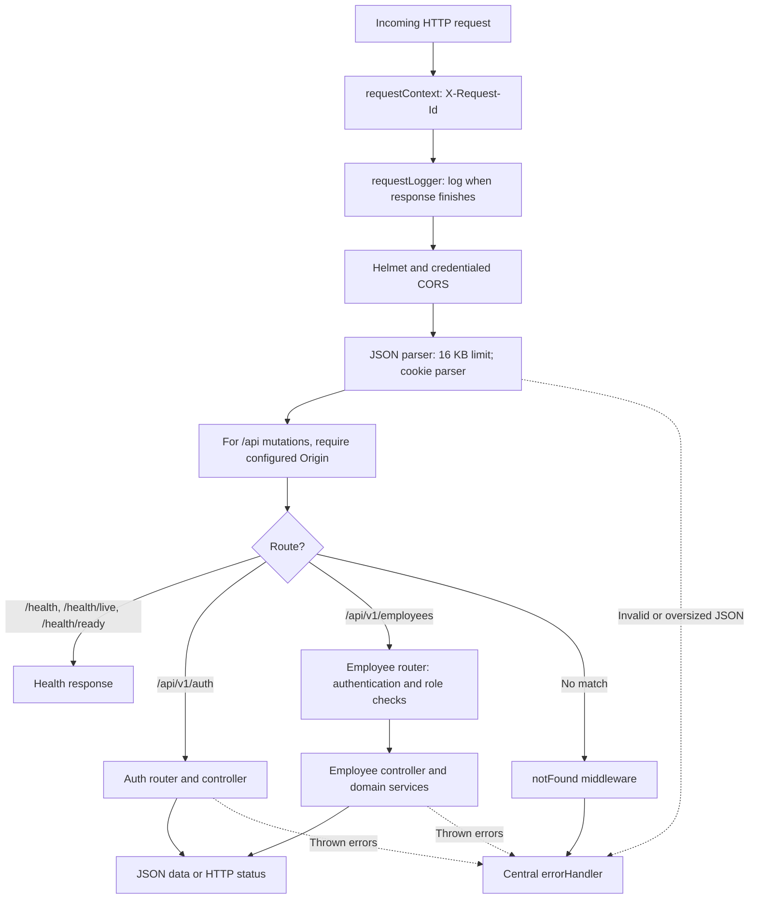

#### Validation and compatibility

Validation keeps writes within supported fields and normalizes legacy names.
Response aliases and frontend normalization keep cached clients and older data
usable during migration.

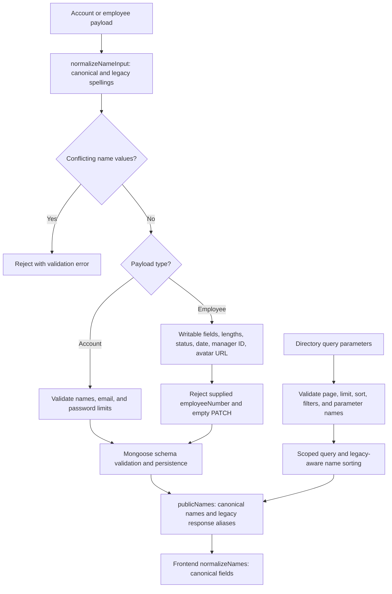

#### Employee domain subsystem

The router delegates to `employeeController`, which calls `employeeService`.
Employee-role reads match the account email; HR and admins can read the directory.

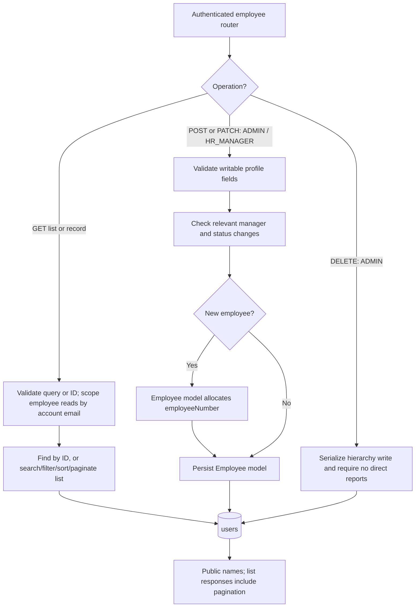

#### Manager hierarchy

`employeeHierarchy` serializes relationship writes within the single API process.
Multi-process deployments will need shared coordination. PATCH preserves an
omitted manager and clears it when explicitly set to `null`.

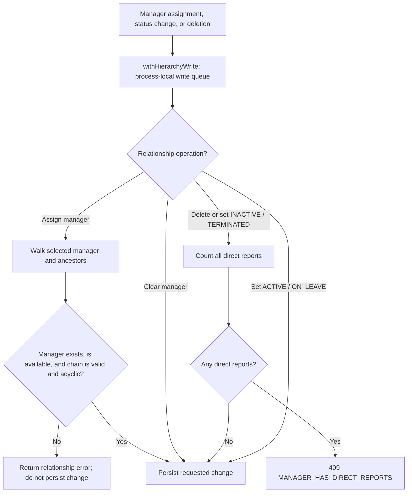

#### Employee number allocation

The Employee model allocates a number before validating a new record. MongoDB
increments the persistent counter atomically without reusing allocated sequence
values; the employee collection's unique index prevents duplicates.

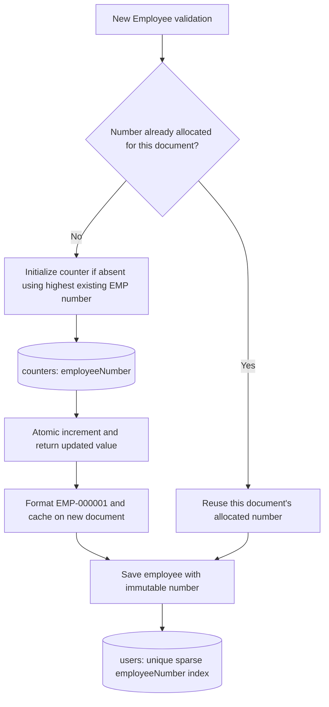

#### Error handling subsystem

Explicit domain errors preserve their status and details. Unexpected failures are
logged and return a generic message with a request ID.

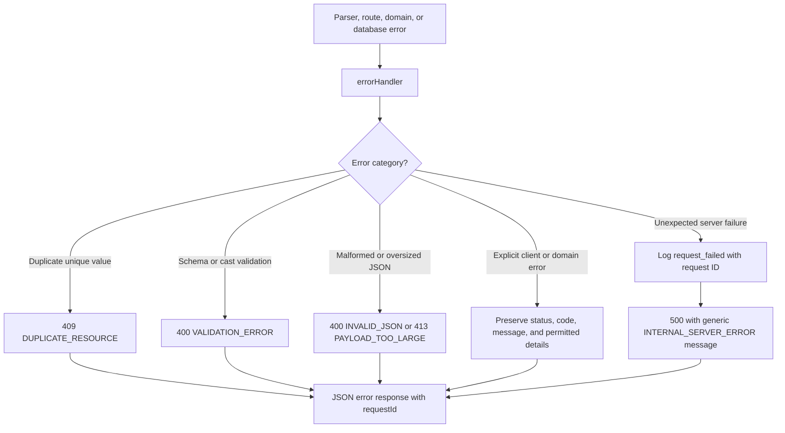

#### Server lifecycle

`backend/server.js` connects to MongoDB and initializes model indexes before
listening. Shutdown closes the HTTP server and disconnects the database, with a
ten-second forced-exit deadline.

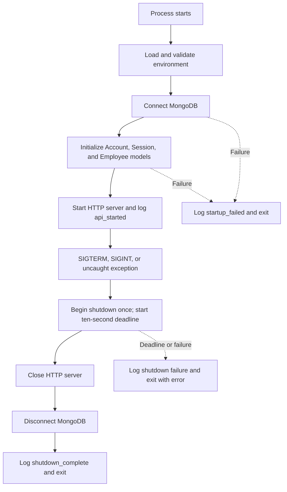

### Target distributed system

**Planned:** extract the existing identity and employee modules into independent
services, add gateway and audit services, and give each domain its own logical
data store. The browser loads static assets through CloudFront and sends API
requests to the load balancer and gateway.

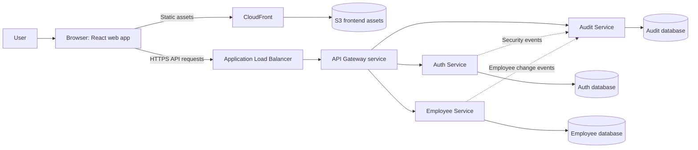

### Architectural Principles

These principles guide the planned service extraction:

1. Each service has a focused responsibility.
2. Services are independently deployable.
3. Business logic stays outside route handlers.
4. Each service owns its data.
5. The frontend communicates through a single API entry point.
6. Configuration is environment-specific.
7. Infrastructure is reproducible through code.
8. Security is enforced server-side.
9. Services expose health endpoints for operational visibility.
10. Architecture complexity is introduced only when it provides a clear engineering benefit.

---

## Microservices

These are **planned deployment boundaries**. Auth and employee functionality
currently run as modules in `backend/`; an independent gateway and Audit Service
have not been implemented.

### Auth Service

Planned extraction of the current identity and access-management module.

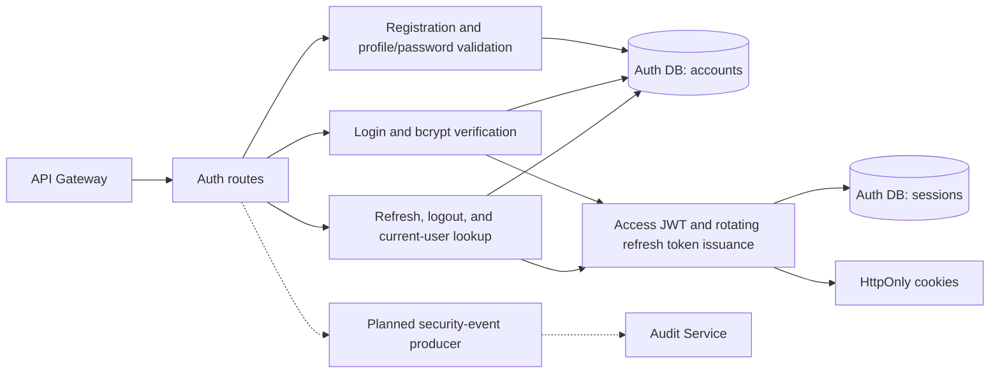

Responsibilities include:

- User registration
- Authentication
- Password hashing
- Access-token creation
- Refresh-token lifecycle
- Logout
- User roles
- Authorization information
- Current authenticated user

Example routes:

```text
POST /api/v1/auth/register
POST /api/v1/auth/login
POST /api/v1/auth/refresh
POST /api/v1/auth/logout
GET  /api/v1/auth/me
```

---

### Employee Service

Planned extraction of the implemented employee domain into its own service.

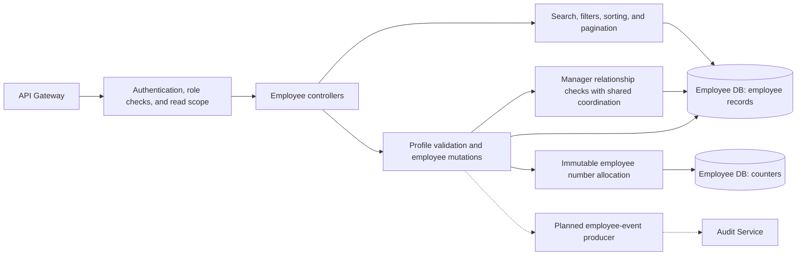

Responsibilities include:

- Employee CRUD operations
- Employee search
- Filtering
- Sorting
- Pagination
- Department information
- Employment status
- Employee-manager relationships

Example routes:

```text
GET    /api/v1/employees
POST   /api/v1/employees
GET    /api/v1/employees/:id
PATCH  /api/v1/employees/:id
DELETE /api/v1/employees/:id
```

Example query:

```text
GET /api/v1/employees?page=1&limit=20&department=Engineering&status=ACTIVE&sortBy=lastName&sortOrder=asc
```

---

### Audit Service

Planned service for storing administrative activity. Request logging in the
current API does not provide this persistent audit history.

```mermaid
flowchart TD
    Auth["Auth Service: security events"] --> Ingest["Planned event ingestion"]
    Employees["Employee Service: change events"] --> Ingest
    Ingest --> Validate["Validate actor, action, target, timestamp, and metadata"]
    Validate --> Store[("Audit DB: append-oriented records")]
    Gateway["API Gateway: audit queries"] --> Authorize["Authorize audit-history access"]
    Authorize --> Query["Filter and paginate audit records"]
    Query --> Store
    Store --> Response["Authorized history response"]
    Future["Future message broker"] -.-> Ingest
```

Responsibilities include:

- Recording employee changes
- Recording security-relevant events
- Providing authorized audit-history queries
- Maintaining an append-oriented activity history

Example routes:

```text
GET /api/v1/audit
GET /api/v1/audit/:id
```

A later version can use asynchronous events so domain services publish events without waiting for the Audit Service.

---

### API Gateway

Planned single entry point for frontend API traffic. Equivalent request controls
currently live in the Express application's shared middleware and routers.

```mermaid
flowchart TD
    Request["Browser API request"] --> Controls["CORS, security headers, request ID, logging, and rate limits"]
    Controls --> Policy["Gateway authentication policy where applicable"]
    Policy --> Route{"Request path?"}
    Route -->|"/api/v1/auth/*"| Auth["Auth Service"]
    Route -->|"/api/v1/employees/*"| Employees["Employee Service"]
    Route -->|"/api/v1/audit/*"| Audit["Audit Service"]
    Route -->|"Unknown path"| Missing["404 response"]
    Auth --> Response["Return service response with request correlation"]
    Employees --> Response
    Audit --> Response
```

Responsibilities may include:

- Request routing
- CORS
- Rate limiting
- Request IDs
- Common security headers
- Centralized request logging
- Authentication-related gateway policies

Example routing:

```text
/api/v1/auth/*       -> auth-service
/api/v1/employees/*  -> employee-service
/api/v1/audit/*      -> audit-service
```

---

## Technology Stack

### Frontend

- React
- JavaScript
- React Router
- Axios
- CSS
- Environment-based configuration

The frontend can be incrementally modernized during the refactor without requiring a complete rewrite.

### Backend

- Node.js 26.10.0 (pinned in `.nvmrc`)
- Express.js
- JavaScript
- Mongoose
- JWT
- bcrypt
- REST APIs

### Database

- MongoDB
- Mongoose ODM
- MongoDB Atlas for cloud-hosted production data

### DevOps

- Docker
- Docker Compose
- GitHub Actions
- Terraform

### AWS

Target AWS services include:

- Amazon ECS
- AWS Fargate
- Amazon ECR
- Application Load Balancer
- Amazon S3
- Amazon CloudFront
- AWS Certificate Manager
- Amazon CloudWatch
- AWS Secrets Manager and/or Systems Manager Parameter Store
- Amazon Route 53
- AWS IAM
- Amazon VPC

---

## Repository Structure

The target repository structure is:

```text
worksphere/
|
+-- apps/
|   +-- web/
|       +-- public/
|       +-- src/
|       |   +-- api/
|       |   +-- components/
|       |   +-- features/
|       |   |   +-- auth/
|       |   |   +-- employees/
|       |   |   +-- dashboard/
|       |   +-- layouts/
|       |   +-- pages/
|       |   +-- routes/
|       |   +-- hooks/
|       |   +-- utils/
|       +-- Dockerfile
|       +-- package.json
|
+-- services/
|   +-- auth-service/
|   |   +-- src/
|   |   |   +-- config/
|   |   |   +-- controllers/
|   |   |   +-- middleware/
|   |   |   +-- models/
|   |   |   +-- routes/
|   |   |   +-- services/
|   |   |   +-- utils/
|   |   +-- tests/
|   |   +-- Dockerfile
|   |   +-- package.json
|   |
|   +-- employee-service/
|   |   +-- src/
|   |   +-- tests/
|   |   +-- Dockerfile
|   |   +-- package.json
|   |
|   +-- audit-service/
|       +-- src/
|       +-- tests/
|       +-- Dockerfile
|       +-- package.json
|
+-- gateway/
|   +-- src/
|   +-- Dockerfile
|   +-- package.json
|
+-- infrastructure/
|   +-- terraform/
|       +-- modules/
|       +-- environments/
|           +-- dev/
|           +-- prod/
|
+-- .github/
|   +-- workflows/
|       +-- frontend-ci.yml
|       +-- services-ci.yml
|       +-- deploy.yml
|
+-- docs/
|   +-- architecture/
|   +-- api/
|
+-- docker-compose.yml
+-- .env.example
+-- .gitignore
+-- README.md
+-- LICENSE
```

---

## Domain Model

The **current** MongoDB model uses four collections. Account and employee
documents are separate; matching email establishes the employee's read scope,
not a stored foreign key. A manager is another document in `users`. The counter
stores allocation state, not employee references.

```mermaid
erDiagram
    ACCOUNT ||--o{ SESSION : "has refresh sessions"
    EMPLOYEE o|--o{ EMPLOYEE : "manages via managerId"
    ACCOUNT {
        ObjectId _id PK
        string firstName
        string lastName
        string email UK
        string passwordHash
        string role
    }
    SESSION {
        ObjectId _id PK
        ObjectId account FK
        string tokenHash UK
        date expiresAt "TTL expiration"
    }
    EMPLOYEE {
        ObjectId _id PK
        string employeeNumber UK "immutable"
        string firstName
        string lastName
        string email UK
        string department
        string jobTitle
        string employmentStatus
        date hireDate
        ObjectId managerId FK
    }
    COUNTER {
        string _id PK "employeeNumber"
        number value "last allocated sequence"
    }
```

`ACCOUNT`, `SESSION`, and `EMPLOYEE` map to `accounts`, `sessions`, and `users`;
the allocation service accesses `counters` directly. The diagram shows core
fields; profile and timestamp fields are omitted for readability.

A simplified employee document can look like:

```json
{
  "_id": "employee-id",
  "employeeNumber": "EMP-000123",
  "firstName": "Jane",
  "lastName": "Doe",
  "email": "jane.doe@example.com",
  "phone": "+1-555-0100",
  "jobTitle": "Software Engineer",
  "department": "Engineering",
  "employmentStatus": "ACTIVE",
  "hireDate": "2026-01-15T00:00:00.000Z",
  "managerId": "manager-id",
  "location": "Chicago",
  "avatarUrl": null,
  "createdAt": "2026-01-15T14:20:00.000Z",
  "updatedAt": "2026-01-15T14:20:00.000Z"
}
```

Example statuses:

```text
ACTIVE
ON_LEAVE
INACTIVE
TERMINATED
```

Domain validation is performed by the backend before persistence.

---

## API Design

WorkSphere APIs use versioned REST endpoints:

```text
/api/v1/...
```

The **current REST interface** returns resource data, pagination metadata for
lists, and HTTP status codes for mutations and failures.

```mermaid
flowchart TD
    Request["/api/v1 request"] --> Router["Versioned auth or employee router"]
    Router --> Operation["Authorized and validated operation"]
    Operation --> Kind{"Result type?"}
    Kind -->|"Read or update"| OK["200 with data"]
    Kind -->|"List employees"| List["200 with data and pagination"]
    Kind -->|"Create account or employee"| Created["201 with data"]
    Kind -->|"Logout or delete employee"| Empty["204 with no response body"]
    Operation -.->|Failure| Error["4xx or 5xx with error message; central handler adds code and requestId"]
```

Example success response:

```json
{
  "data": {
    "_id": "employee-id",
    "firstName": "Jane",
    "lastName": "Doe"
  }
}
```

Example error response:

```json
{
  "error": {
    "code": "EMPLOYEE_NOT_FOUND",
    "message": "Employee was not found."
  }
}
```

Paginated responses include metadata:

```json
{
  "data": [],
  "pagination": {
    "page": 1,
    "limit": 20,
    "totalItems": 124,
    "totalPages": 7
  }
}
```

---

## Authentication and Authorization

The **current identity subsystem** uses bcrypt, 15-minute access JWTs, and
seven-day refresh sessions. Registration creates an employee-role account without
signing it in.

### Registration and login

```mermaid
sequenceDiagram
    actor User
    participant Web as AuthPage and AuthContext
    participant API as Auth router and controller
    participant Accounts as accounts collection
    participant Sessions as sessions collection
    User->>Web: Submit registration
    Web->>API: POST /api/v1/auth/register
    API->>API: Validate profile and hash password with bcrypt
    API->>Accounts: Create account with EMPLOYEE role
    Accounts-->>API: Account created
    API-->>Web: 201 with public account and no session cookies
    Web-->>User: Redirect to login with success notice
    User->>Web: Submit login credentials
    Web->>API: POST /api/v1/auth/login
    API->>Accounts: Find normalized email and password hash
    API->>API: Verify bcrypt password
    alt Credentials valid
        API->>Sessions: Store refresh-token hash and expiration
        API->>API: Sign access JWT with account and session IDs
        API-->>Web: Set HttpOnly access and refresh cookies and return public account
        Web-->>User: Open protected workspace
    else Credentials invalid
        API-->>Web: 401 with generic credential error
    end
```

### Session rotation and revocation

The browser restores a session on app startup or after the shared client receives
a 401. Refresh consumes the old session before issuing new cookies. Authentication
also checks the MongoDB session, making logout effective immediately.

```mermaid
sequenceDiagram
    participant Web as Browser API client
    participant API as Auth controller
    participant Sessions as sessions collection
    participant Accounts as accounts collection
    Web->>API: POST /auth/refresh with refresh cookie
    API->>API: SHA-256 hash refresh token
    API->>Sessions: Find and delete matching unexpired session
    Sessions-->>API: Consumed session or none
    API->>Accounts: Load session account if found
    alt Session and account valid
        API->>Sessions: Create replacement refresh session
        API-->>Web: Set rotated cookies and return public account
        Web->>Web: Retry original request once when applicable
    else Session or account missing
        API-->>Web: Clear cookies and return 401
        Web->>Web: Clear signed-in state
    end
    Web->>API: POST /auth/logout with refresh cookie
    API->>Sessions: Delete session matching refresh-token hash
    API-->>Web: Clear cookies and return 204
```

### Permission enforcement

The implemented permissions are:

| Operation | ADMIN | HR_MANAGER | EMPLOYEE |
| --- | :---: | :---: | :---: |
| View employees | Yes | Yes | Limited |
| Create employee | Yes | Yes | No |
| Update/deactivate employee | Yes | Yes | No |
| Delete employee | Yes | No | No |

Employee reads are limited to records matching the account email. Manager
deletion and deactivation additionally require handling all direct reports.
Audit-history access and public role management are planned, with no current API
endpoints. The first administrator is provisioned manually as described above.

```mermaid
flowchart TD
    Request["Protected API request"] --> JWT["Verify ws_access JWT signature, issuer, audience, and expiration"]
    JWT --> Session["Find unexpired session matching JWT sid and sub"]
    Session --> Account["Load account and attach req.user"]
    JWT -.->|Invalid| Unauthorized["401"]
    Session -.->|Missing| Unauthorized
    Account -.->|Missing| Unauthorized
    Account --> Operation{"Employee operation?"}
    Operation -->|Read| Role{"Account role?"}
    Role -->|EMPLOYEE| Scope["Limit records to matching account email"]
    Role -->|"ADMIN or HR_MANAGER"| Directory["Directory-wide reads"]
    Operation -->|"Create or update"| Manage{"ADMIN or HR_MANAGER?"}
    Operation -->|Delete| Admin{"ADMIN?"}
    Manage -->|Yes| Domain["Validated domain operation"]
    Admin -->|Yes| Domain
    Manage -->|No| Forbidden["403"]
    Admin -->|No| Forbidden
```

---

## Local Development

### Prerequisites

Install:

- Node.js 26.10.0 (pinned in `.nvmrc`)
- npm
- Git
- Docker Desktop
- Docker Compose

MongoDB does not need to be installed locally when using the Docker Compose development environment.

### Clone the Repository

```bash
git clone <your-repository-url>
cd worksphere
```

### Configure Environment Variables

Copy the example configuration:

```bash
cp backend/.env.example backend/.env
cp frontend/.env.example frontend/.env
```

On Windows PowerShell:

```powershell
Copy-Item backend/.env.example backend/.env
Copy-Item frontend/.env.example frontend/.env
```

Update the values required for your environment.

### Start with Docker Compose

The implemented local stack starts from the repository root:

```bash
docker compose up --build
```

This starts MongoDB, the Express API, and the Nginx-served React frontend. Compose
waits for MongoDB and API readiness in that order. Configure a strong
`JWT_ACCESS_SECRET` in `backend/.env` before starting.

```mermaid
flowchart TD
    Configure["Configure backend/.env and frontend API build URL"] --> Compose["docker compose up --build"]
    Compose --> Mongo["Start mongo service"]
    Mongo --> Ping{"MongoDB ping healthy?"}
    Ping -->|Yes| API["Start api service"]
    API --> Ready{"/health/ready returns 200?"}
    Ready -->|Yes| Web["Start web service"]
    Web --> Browser["Open localhost:3000"]
    Compose --> Volume[("worksphere-data volume")]
    Volume --> Mongo
```

The planned distributed stack will add the gateway and separate Auth, Employee,
and Audit services described in [Microservices](#microservices).

Stop the environment with:

```bash
docker compose down
```

Remove local volumes when a complete reset is required:

```bash
docker compose down -v
```

---

## Docker

The **current container subsystem** has Dockerfiles for the API and frontend.
The frontend uses a Node build stage and an Nginx runtime stage; the API installs
production dependencies and runs as the `node` user.

```mermaid
flowchart LR
    subgraph APIBuild["backend/Dockerfile"]
        Backend["Backend source and lockfile"] --> APIInstall["Node 26.10.0 Alpine: npm ci --omit=dev"]
        APIInstall --> APIImage["Copy server, src, and scripts; run as node user"]
        APIImage --> API["Express container: port 5000"]
    end
    subgraph WebBuild["frontend/Dockerfile"]
        Frontend["Frontend source and lockfile"] --> WebInstall["Node 26.10.0 build stage: npm ci"]
        URL["Build argument: REACT_APP_API_URL"] --> Bundle["npm run build"]
        WebInstall --> Bundle
        Bundle --> Nginx["Nginx Alpine: static bundle and SPA fallback"]
    end
    Browser["Local browser"] -->|"localhost:3000"| Nginx
    Browser -->|"localhost:5000/api/v1"| API
    API -->|"Compose network: mongo:27017"| Mongo[("mongo:7")]
    Mongo --> Volume[("worksphere-data")]
```

Both published web and API ports bind to `127.0.0.1` for local development; MongoDB
is reachable within the Compose network. Backend cloud containers on ECS/Fargate
and their image delivery are [planned](#deployment-pipeline).

### Container verification

`container-ci.yml` builds both images and starts the root Compose stack with
`docker-compose.ci.yml`. The override removes host ports and local environment
files, supplies a generated test secret, and adds a frontend health check. Each
run uses a separate project, network, and MongoDB volume. The workflow also adds
the browser override described under [end-to-end tests](#end-to-end).

The checks verify API readiness and database connectivity, the Node.js version
from `.nvmrc`, rejection of unauthenticated employee reads, frontend HTML and
assets, and Nginx's client-side routing fallback. Failed runs print service status
and logs. The script removes its containers, network, and database volume on exit.

Run the same verification locally with Bash, OpenSSL, Docker, and a recent Docker
Compose version supporting `!reset`:

```sh
bash .github/scripts/verify-containers.sh
```

```mermaid
flowchart TD
    Trigger["Backend, frontend, Compose, version, or verification changes"] --> Build["Build both Docker images"]
    Build --> Start["Start isolated Compose project with generated test secret"]
    Start --> Health["Wait for MongoDB, API, and frontend health"]
    Health --> API["Check API readiness, MongoDB, runtime version, and protected route"]
    API --> Web["Check HTML, JavaScript, CSS, and SPA routing fallback"]
    Web --> Pass["Verification passes"]
    Build -.->|Failure| Logs["Print service status and logs"]
    Health -.->|Failure| Logs
    API -.->|Failure| Logs
    Web -.->|Failure| Logs
    Pass --> Cleanup["Remove test containers, network, and database volume"]
    Logs --> Cleanup
```

---

## Testing

The current automated checks cover backend behavior, frontend features,
container readiness, and full browser workflows against the real API and MongoDB.

### Backend

The backend uses Node's test runner, Supertest, and isolated MongoDB instances.

```mermaid
flowchart TD
    Run["backend: npm test"] --> Runner["Node test runner: tests/*.test.js"]
    Runner --> Unit["Validation, migrations, numbers, and error handling"]
    Runner --> Integration["Auth, employee API, and operational tests"]
    Integration --> HTTP["Supertest requests against Express app"]
    Unit --> DB[("mongodb-memory-server where required")]
    HTTP --> DB
    DB --> Isolation["Ephemeral test data; application database untouched"]
    Unit --> Result["Assertions and test result"]
    Integration --> Result
```

- Unit tests
- Controller/service tests
- API integration tests
- Authentication tests
- Authorization tests
- Validation tests
- Error-handling tests

### Frontend

React Scripts runs Jest and Testing Library tests, with API behavior supplied by
mocks rather than the application database.

```mermaid
flowchart TD
    Run["frontend: CI=true npm test -- --watchAll=false --runInBand"] --> Jest["React Scripts / Jest"]
    Jest --> Auth["AuthContext and AuthPage tests"]
    Jest --> Directory["EmployeesPage tests"]
    Jest --> Adapter["Employee API adapter tests"]
    Auth --> Mocks["Mock API and authentication dependencies"]
    Directory --> Mocks
    Adapter --> Mocks
    Auth --> Assertions["Testing Library: rendered state and user interactions"]
    Directory --> Assertions
    Adapter --> Data["Request and response assertions"]
    Assertions --> Result["Test result"]
    Data --> Result
```

- Component tests
- Page/feature tests
- API-state tests
- Authentication-flow tests

### End-to-End

Playwright runs Chromium against the built frontend, API, and MongoDB containers.
The suite in `frontend/e2e/employee-workflows.spec.js` covers:

- Registration, normalized email, login, reading the employee's own profile,
  session restoration after reload, and logout.
- Administrator employee creation, generated numbers, search, persisted edits,
  cancelled and confirmed deletion, and logout.
- HR manager creation and persisted updates, with deletion blocked.
- Employee-only read scope and hidden management controls. Direct API requests
  with the browser's cookies verify that restricted reads and writes return
  `403`; replaying old cookies after logout verifies session revocation.

The shared container verification script builds and checks the stack before
seeding test administrator and HR accounts. Public registration still creates
an `EMPLOYEE` account. Each test uses a fresh browser context and unique employee
emails, and each run owns an empty database volume that is removed on exit.
Requests use the real application; no API mocking is involved.

From `frontend`, with the Node.js version in `.nvmrc`, Bash, OpenSSL, Docker, and
a recent Docker Compose version available:

```sh
npm ci
npx playwright install --with-deps chromium
npm run test:e2e
# Open the report after the run:
npm run test:e2e:report
```

`docker-compose.e2e.yml` merges after the CI override and publishes loopback
ports `3100` for the web app and `5100` for the API. Override
`WORKSPHERE_E2E_WEB_PORT` and `WORKSPHERE_E2E_API_PORT` if those ports are occupied;
the script synchronizes the frontend API URL, allowed origin, and test URLs.
The API uses development cookie settings for this local HTTP test stack.
The container-only command above continues to check production settings without
publishing ports.

GitHub Actions installs Chromium and its system dependencies, runs the same
command with one worker and one retry, and uploads the HTML report and failure
traces, screenshots, and videos for 14 days. Generated output is excluded from
Git and Docker build contexts. The workflow follows the
[Playwright CI setup](https://playwright.dev/docs/ci).

```mermaid
flowchart TD
    Run["npm run test:e2e / Container CI"] --> Stack["Build, start, and smoke-check isolated Compose stack"]
    Stack --> Seed["Seed test administrator, HR manager, and reference employee"]
    Seed --> Browser["Playwright Chromium: fresh context per test"]
    Browser --> Register["Register EMPLOYEE account and log in"]
    Register --> Own["Read own profile; deny other profiles and all writes"]
    Browser --> Admin["Admin login: create, search, edit, reload, and delete"]
    Browser --> HR["HR login: create and edit; deny delete"]
    Own --> Logout["Log out; reject replayed cookies and redirect protected route"]
    Admin --> Logout
    HR --> Logout
    Logout --> Report["HTML report; failure traces, screenshots, and videos"]
    Browser -.->|Failure| Report
    Report --> Cleanup["Remove test containers, network, and database volume"]
```

CI must run automated tests before deployment.

---

## API Documentation

Backend APIs will be documented with OpenAPI/Swagger.

The **planned API documentation subsystem** will maintain a versioned contract
and expose an interactive Swagger UI.

```mermaid
flowchart LR
    Routes["Auth, employee, and future audit endpoints"] --> Spec["OpenAPI specification"]
    Models["Request, response, and error schemas"] --> Spec
    Policies["Cookie authentication and role requirements"] --> Spec
    Spec --> Validate["Planned contract validation in CI"]
    Spec --> UI["Swagger UI"]
    UI --> Developer["Developer explores and exercises API"]
```

Documentation should describe:

- Available endpoints
- Authentication requirements
- Request bodies
- Query parameters
- Response models
- HTTP status codes
- Validation failures
- Authorization requirements

The Swagger UI URL will be documented here after the API documentation layer is implemented.

---

## CI/CD

GitHub Actions currently validates backend, frontend, container, and browser behavior. Automated AWS
deployment, lint gates, and security scans remain planned.

### Pull Request / CI Pipeline

The implemented workflows run on matching changes in pushes and pull requests to
`main` or `develop`, and can also be started manually. Each workflow cancels an
older run for the same ref. All three read the Node.js version from `.nvmrc`, and a
change to that file triggers all three workflows.

```mermaid
flowchart TD
    Trigger["Push / pull request to main or develop; manual dispatch"] --> Scope{"Changed paths or selected workflow?"}
    Scope -->|"backend/** or .nvmrc"| Backend["backend-ci.yml: checkout and Node 26.10.0"]
    Scope -->|"frontend/** or .nvmrc"| Frontend["frontend-ci.yml: checkout and Node 26.10.0"]
    Backend --> BackendInstall["npm ci with npm cache"]
    BackendInstall --> BackendSyntax["npm run check: JavaScript syntax validation"]
    BackendSyntax --> BackendTests["npm test: backend integration and unit tests"]
    Frontend --> FrontendInstall["npm ci with npm cache"]
    FrontendInstall --> FrontendTests["CI=true npm test -- --watchAll=false --runInBand"]
    FrontendTests --> FrontendBuild["CI=true npm run build"]
    Scope -->|"App, Compose, .nvmrc, or verification files"| Containers["container-ci.yml: install Node and Chromium; verify Compose stack"]
    Containers --> Browser["Seed test roles and run Playwright browser workflows"]
    Browser --> Reports["Upload HTML report and failure diagnostics"]
    BackendTests --> Result["Workflow status"]
    FrontendBuild --> Result
    Reports --> Result
```

The backend workflow validates JavaScript syntax before running tests; the
frontend workflow runs tests and the production build. A future deployment
workflow will require successful checks. The independent container workflow
also runs when the root Compose files or verification scripts change; see
[container verification](#container-verification) and
[end-to-end tests](#end-to-end) for its checks and local commands.

### Deployment Pipeline

**Planned backend delivery subsystem:**

```mermaid
flowchart TD
    Merge["Merge to deployment branch"] --> Gates["Tests, build validation, and planned security scans"]
    Gates --> Auth["GitHub OIDC obtains short-lived AWS credentials"]
    Auth --> Build["Build and tag service images"]
    Build --> ECR[("Amazon ECR repositories")]
    ECR --> Definition["Update ECS task definitions with image references"]
    Definition --> Deploy["Roll out ECS/Fargate services"]
    Deploy --> Health{"Health verification succeeds?"}
    Health -->|Yes| Complete["Deployment complete"]
    Health -->|No| Rollback["Fail deployment and restore healthy revision"]
```

**Planned frontend delivery subsystem:**

```mermaid
flowchart LR
    Checks["Frontend tests pass"] --> Config["Production REACT_APP_API_URL at build time"]
    Config --> Build["React production build"]
    Build --> Upload["Upload versioned static assets"]
    Upload --> S3[("S3 web bucket")]
    S3 --> CDN["CloudFront serves assets"]
    Upload --> Invalidate["Invalidate changed entry documents"]
    Invalidate --> CDN
    CDN --> Verify["Verify frontend and API connectivity"]
```

Production AWS authentication from GitHub should use short-lived credentials through GitHub Actions OIDC rather than long-lived AWS access keys where practical.

---

## AWS Deployment Architecture

The production system below is **planned**; AWS deployment code is not present
in this repository. Static hosting, API compute, data, image distribution,
configuration, and monitoring have separate responsibilities.

```mermaid
flowchart TD
    Browser["Browser"] -->|"Resolve frontend and API hosts"| DNS["Route 53"]
    Browser -->|"HTTPS static requests"| CDN["CloudFront"]
    CDN --> S3[("Private S3 web bucket")]
    Browser -->|"HTTPS API requests"| ALB["Application Load Balancer"]
    ACM["ACM TLS certificates"] -.-> CDN
    ACM -.-> ALB
    DNS -.-> CDN
    DNS -.-> ALB
    subgraph Compute["ECS / Fargate service subsystem"]
        Gateway["Gateway tasks"]
        Auth["Auth tasks"]
        Employee["Employee tasks"]
        Audit["Audit tasks"]
        Gateway --> Auth
        Gateway --> Employee
        Gateway --> Audit
    end
    ALB --> Gateway
    Auth --> AuthDB[("Atlas: auth logical database")]
    Employee --> EmployeeDB[("Atlas: employee logical database")]
    Audit --> AuditDB[("Atlas: audit logical database")]
    ECR[("ECR container images")] -.-> Compute
    Secrets["Secrets Manager / Parameter Store"] -.-> Compute
    IAM["IAM execution and task roles"] -.-> Compute
    Compute --> Monitoring["CloudWatch logs, metrics, and alarms"]
```

### Network subsystem

**Planned:** use public subnets for the load balancer and private subnets for API
tasks across availability zones. Security groups limit inbound service traffic;
the Atlas connection and required AWS access need controlled outbound paths.
The diagram illustrates NAT-based egress; private connectivity and VPC endpoints
can replace applicable paths when the deployment is designed.

```mermaid
flowchart TD
    Internet["Internet"] --> IGW["Internet gateway"]
    subgraph VPC["Planned VPC across availability zones"]
        subgraph Public["Public subnets"]
            ALB["Public ALB: HTTPS listener"]
            NAT["NAT gateway for outbound traffic"]
        end
        subgraph Private["Private subnets"]
            Gateway["Gateway ECS tasks"]
            Services["Auth, Employee, and Audit ECS tasks"]
        end
        ALB -->|"Gateway security group permits ALB traffic"| Gateway
        Gateway -->|"Service security groups permit gateway traffic"| Services
        Gateway --> NAT
        Services --> NAT
    end
    IGW --> ALB
    NAT -->|"Outbound path through internet gateway"| External["Atlas and required AWS endpoints"]
    Groups["Security groups and route tables"] -.-> VPC
```

Backend services will run in containers without requiring EC2 server administration.

---

## Infrastructure as Code

Terraform will provision the AWS infrastructure.

The Terraform configuration will be organized into reusable modules.

The **planned infrastructure subsystem** separates modules by resource ownership.
Both development and production configurations compose the same modules with
environment-specific inputs.

```mermaid
flowchart TD
    Environments["dev / prod environment configuration"] --> Plan["Terraform plan and reviewed apply"]
    Plan --> Network["networking module: VPC, subnets, routing, security groups"]
    Plan --> Registry["ecr module: image repositories"]
    Plan --> Security["security module: IAM roles and secret references"]
    Plan --> Frontend["frontend module: S3, CloudFront, DNS, and TLS"]
    Plan --> Monitoring["monitoring module: log groups, metrics, and alarms"]
    Network --> ALB["alb module: listeners and target groups"]
    Network --> ECS["ecs module: cluster, tasks, and services"]
    Registry --> ECS
    Security --> ECS
    Monitoring --> ECS
    ALB --> ECS
    ECS --> API["Outputs: API endpoint and service identifiers"]
    Frontend --> Web["Outputs: frontend bucket and distribution identifiers"]
    API --> Delivery["Deployment workflow consumes infrastructure outputs"]
    Web --> Delivery
```

Example:

```text
infrastructure/terraform/
|
+-- modules/
|   +-- networking/
|   +-- ecr/
|   +-- ecs/
|   +-- alb/
|   +-- frontend/
|   +-- monitoring/
|   +-- security/
|
+-- environments/
    +-- dev/
    +-- prod/
```

Infrastructure may include:

- VPC
- Public/private subnets
- Route tables
- Security groups
- ECS cluster
- ECS task definitions/services
- ECR repositories
- Application Load Balancer
- S3 bucket
- CloudFront distribution
- IAM roles/policies
- CloudWatch configuration
- Secret references

Sensitive secret values must not be committed to Terraform source files.

---

## Observability

### Application logging and health

The **current observability subsystem** creates or accepts a validated request
ID, returns it as `X-Request-Id`, and records JSON logs on stdout/stderr. Completed
requests include method, path, status, and duration. Server failures and process
lifecycle events use the same logger.

```mermaid
flowchart LR
    Request["HTTP request"] --> Context["Validate incoming request ID or create UUID"]
    Context --> Response["X-Request-Id response header"]
    Context --> Completion["Response finish event"]
    Completion --> Log["requestLogger: method, path, status, duration"]
    Failure["Unexpected API error"] --> Error["errorHandler: request_failed"]
    Lifecycle["Startup and shutdown events"] --> Logger["JSON logger"]
    Log --> Logger
    Error --> Logger
    Logger --> Output["stdout / stderr"]
    Probes["Health clients and Compose"] --> Live["/health/live: HTTP process responds"]
    Probes --> Ready["/health/ready: MongoDB connection state"]
    Ready --> Mongo[("MongoDB")]
```

`GET /health/live` checks liveness. `GET /health/ready` returns 200 only when
MongoDB is connected and otherwise returns 503. `/health` remains a compatibility
endpoint. A ready response looks like:

```json
{
  "status": "UP",
  "service": "worksphere-api",
  "dependencies": { "mongodb": "UP" }
}
```

Sensitive values such as passwords, tokens, and secrets must never be written to logs.

### Cloud monitoring subsystem

**Planned:** collect container logs, operational metrics, and health signals in
CloudWatch, with alarms for failures and availability issues.

```mermaid
flowchart LR
    Logs["ECS task stdout / stderr"] --> Groups["CloudWatch Logs: per-service log groups"]
    Metrics["ECS resource and ALB request metrics"] --> Cloud["CloudWatch Metrics"]
    Health["Service health and readiness signals"] --> Cloud
    Groups --> Correlation["Investigate by service, time, and request ID"]
    Cloud --> Dashboards["Operational dashboards"]
    Cloud --> Alarms["Availability, error-rate, and resource alarms"]
    Alarms --> Response["Operational response"]
```

---

## Security

Security is treated as an application and infrastructure concern.

The **current application security subsystem** applies request controls before
business operations and keeps authentication credentials in HttpOnly cookies.

```mermaid
flowchart TD
    Browser["Browser request"] --> Headers["Helmet security headers and configured credentialed CORS"]
    Headers --> Parser["16 KB JSON body limit"]
    Parser --> Origin["Exact Origin check for API mutations"]
    Origin --> Route{"Endpoint category?"}
    Route -->|"Login or registration"| Limit["Shared per-IP rate limit"]
    Limit --> Password["Profile validation and bcrypt password processing"]
    Route -->|Protected| JWT["JWT signature and claim validation"]
    JWT --> Session["MongoDB session and account lookup"]
    Session --> Roles["Server-side role checks and employee read scope"]
    Roles --> Validation["Domain payload, query, and relationship validation"]
    Validation --> Data[("Validated database operations")]
    Password -->|"Successful login only"| Cookies["HttpOnly, SameSite=Strict; Secure in production"]
    Password -->|Registration| Account["Create EMPLOYEE account without session cookies"]
    Secrets["Validated JWT_ACCESS_SECRET from environment"] --> JWT
```

Implemented controls include:

- Password hashing with bcrypt
- JWT validation
- Short-lived access tokens
- Refresh-token handling
- Role-based authorization
- Request validation
- CORS configuration
- Security headers
- Rate limiting
- Environment-based secrets
- Generic responses for unexpected server errors

HTTPS, least-privilege IAM, protected cloud databases, dependency scanning, and
container-image scanning are planned deployment controls. The in-memory login
rate limiter and manager-write queue currently support one API process; shared
coordination is needed before running replicas.

Production secrets must never be committed to Git.

---

## Environment Variables

The **current configuration subsystem** separates backend runtime values from
the frontend's build-time API URL. Standalone migration commands only load the
database connection configuration and do not require a JWT secret.

```mermaid
flowchart LR
    Backend["backend/.env or process environment"] --> Env["backend/src/config/env.js"]
    Env --> Secret{"JWT_ACCESS_SECRET at least 32 characters?"}
    Secret -->|No| Stop["Abort API startup"]
    Secret -->|Yes| Token["JWT signing and verification"]
    Env --> DB["MONGO_URI: database connection"]
    Env --> Origin["CLIENT_ORIGIN: CORS and mutation origin"]
    Env --> Server["PORT: HTTP listener"]
    Env --> Cookies["NODE_ENV: production cookie security"]
    Backend --> Migrations["Migration scripts load MONGO_URI directly"]
    Frontend["frontend/.env or Docker build argument"] --> URL["REACT_APP_API_URL includes /api/v1"]
    URL --> Build["React build embeds API base URL"]
    Build --> Client["Axios clients"]
```

See `backend/.env.example` and `frontend/.env.example` for the supported current
settings. The following additional service-specific configuration is **planned**.

A future `.env.example` may contain values similar to:

```dotenv
NODE_ENV=development

GATEWAY_PORT=5000
AUTH_SERVICE_PORT=5001
EMPLOYEE_SERVICE_PORT=5002
AUDIT_SERVICE_PORT=5003

AUTH_SERVICE_URL=http://auth-service:5001
EMPLOYEE_SERVICE_URL=http://employee-service:5002
AUDIT_SERVICE_URL=http://audit-service:5003

AUTH_MONGODB_URI=mongodb://localhost:27017/worksphere-auth
EMPLOYEE_MONGODB_URI=mongodb://localhost:27017/worksphere-employees
AUDIT_MONGODB_URI=mongodb://localhost:27017/worksphere-audit

JWT_ACCESS_SECRET=replace-me
JWT_REFRESH_SECRET=replace-me

CLIENT_ORIGIN=http://localhost:3000
```

These service-specific names are illustrative. The current refresh token is a
random value stored as a hash, so the implemented API does not use
`JWT_REFRESH_SECRET`.

Do not commit a populated `.env` file.

---

## Development Roadmap

### Phase 1 — Repository Refactor

- [ ] Rename/refactor project to WorkSphere
- [ ] Establish monorepo directory structure
- [ ] Move existing React application into `apps/web`
- [ ] Extract employee CRUD from the current backend
- [ ] Create Employee Service
- [ ] Introduce consistent configuration
- [ ] Add centralized error handling
- [ ] Add request validation

### Phase 2 — Authentication

- [ ] Create Auth Service
- [ ] Implement password hashing
- [ ] Implement login
- [ ] Implement access tokens
- [ ] Implement refresh tokens
- [ ] Implement logout
- [ ] Add authentication middleware
- [ ] Add RBAC
- [ ] Protect employee operations

### Phase 3 — Frontend

- [ ] Refactor API layer
- [ ] Remove hard-coded backend URLs
- [ ] Add protected routes
- [ ] Build application shell/navigation
- [ ] Build dashboard
- [ ] Build employee directory
- [ ] Build employee detail page
- [ ] Add create/edit employee forms
- [ ] Add search
- [ ] Add sorting
- [ ] Add filters
- [ ] Add pagination
- [ ] Improve loading/error/empty states

### Phase 4 — Gateway and Audit

- [ ] Add API Gateway
- [ ] Centralize external API routing
- [ ] Add request IDs
- [ ] Add rate limiting
- [ ] Create Audit Service
- [ ] Record employee-management activity
- [ ] Add authorized audit-log UI

### Phase 5 — Quality

- [ ] Add unit tests
- [ ] Add integration tests
- [ ] Add frontend tests
- [x] Add end-to-end tests
- [ ] Add OpenAPI documentation
- [ ] Add linting/formatting
- [ ] Add structured logging
- [ ] Add health checks

### Phase 6 — Containers and CI

- [ ] Dockerize frontend
- [ ] Dockerize gateway
- [ ] Dockerize services
- [ ] Create Docker Compose environment
- [ ] Create frontend CI workflow
- [ ] Create backend/service CI workflow
- [x] Add image build validation
- [ ] Add dependency/security checks

### Phase 7 — AWS

- [ ] Create Terraform structure
- [ ] Provision networking
- [ ] Create ECR repositories
- [ ] Create ECS/Fargate services
- [ ] Configure Application Load Balancer
- [ ] Deploy React frontend to S3
- [ ] Configure CloudFront
- [ ] Configure MongoDB Atlas connectivity
- [ ] Configure AWS secrets
- [ ] Configure CloudWatch
- [ ] Configure HTTPS
- [ ] Configure domain/DNS
- [ ] Create automated deployment workflow

### Phase 8 — Portfolio Polish

- [x] Add architecture diagrams
- [ ] Add screenshots
- [ ] Add API examples
- [x] Add deployment diagram
- [ ] Add live demo URL
- [ ] Add Swagger URL
- [ ] Add CI status badge
- [ ] Document engineering tradeoffs
- [ ] Document major technical challenges

---

## Engineering Decisions

### Why Employee Management Instead of Inventory Management?

The original application already stores and manages user/person records. Refactoring those records into an employee domain allows existing work to be preserved while introducing a more complete business model.

This leaves more development time for architecture, security, testing, cloud deployment, and user experience.

### Why Microservices?

Microservices are used here as an architectural learning and portfolio objective.

The project intentionally begins with only a few meaningful service boundaries rather than creating a separate service for every entity.

The planned boundaries are:

```mermaid
flowchart LR
    Identity["Identity domain"] --> Auth["Auth Service"]
    Employees["Employee domain"] --> Employee["Employee Service"]
    History["Administrative history domain"] --> Audit["Audit Service"]
```

### Why MongoDB?

MongoDB is retained from the existing MERN application, minimizing unnecessary technology churn while allowing each service to own an independent logical data store.

### Why ECS Fargate?

ECS Fargate provides a strong production deployment target for containerized Node.js services without requiring management of EC2 instances or introducing Kubernetes solely for portfolio complexity.

### Why Terraform?

Terraform makes cloud infrastructure reproducible, reviewable, and version-controlled while demonstrating Infrastructure as Code practices.

---

## Future Improvements

Potential later enhancements include:

- Department Service
- Notification Service
- Employee profile images using S3
- Employee CSV import/export
- Email notifications
- Event-driven communication
- Message broker integration
- Redis caching
- Advanced dashboard analytics
- OpenTelemetry tracing
- Multi-factor authentication
- Single sign-on
- Fine-grained permissions
- Soft-delete and retention policies
- Blue/green deployments
- Separate staging environment

These improvements should be introduced only when the core platform is stable and tested.

The following diagrams are **future design ideas**, not implemented components
or committed deployment choices. They show where each optional subsystem would
connect to the core platform.

### Department and notification services

```mermaid
flowchart LR
    Department["Future Department Service"] --> Departments[("Department-owned data")]
    Department -->|"Organization information"| Employee["Employee Service"]
    Auth["Auth Service"] --> Events["Future message broker: domain events"]
    Employee --> Events
    Events --> Audit["Audit Service event consumer"]
    Events --> Notification["Future Notification Service"]
    Notification --> Preferences[("Notification preferences and delivery state")]
    Notification --> Email["Email provider: employee and security notifications"]
```

### Profile media and bulk data

```mermaid
flowchart LR
    Browser["Browser"] --> Media["Future authorized profile-image workflow"]
    Media --> S3[("S3 profile media")]
    Media --> Profile["Store approved image reference in employee profile"]
    CSV["CSV upload or export request"] --> Bulk["Future import/export subsystem"]
    Bulk --> Validate["Validate records and use employee domain services"]
    Validate --> Employees[("Employee data")]
    Employees --> Export["Authorized CSV export"]
    Profile --> Employees
```

### Caching, analytics, and tracing

```mermaid
flowchart LR
    API["Service request"] --> Cache["Future cache lookup and invalidation"]
    Cache --> Redis[("Redis")]
    Cache -->|"Cache miss"| Domain["Employee domain query"]
    Domain --> Employees[("Employee data")]
    Employees --> Analytics["Future advanced dashboard analytics"]
    Analytics --> Dashboard["Administrative dashboard"]
    API -.-> Instrument["Future OpenTelemetry instrumentation"]
    Instrument --> Collector["Telemetry collector"]
    Collector --> Traces["Trace storage and request investigation"]
```

### Identity and retention extensions

```mermaid
flowchart TD
    User["User sign-in"] --> Identity["Auth Service"]
    Provider["Future single sign-on identity provider"] --> Identity
    Identity --> MFA["Future multi-factor challenge"]
    MFA --> Session["Authenticated session"]
    Session --> Permissions["Future fine-grained permission policies"]
    Permissions --> Employee["Employee operations"]
    Employee --> Retention["Future soft-delete and retention rules"]
    Retention --> Data[("Retained or purged employee data")]
```

### Staging and deployment extensions

```mermaid
flowchart LR
    Artifact["Verified application artifact"] --> Staging["Future separate staging environment"]
    Staging --> Checks["End-to-end and deployment checks"]
    Checks --> Green["Future green ECS deployment"]
    Blue["Existing blue ECS deployment"] --> Traffic["Load-balancer traffic routing"]
    Green --> Health["Verify new deployment health"]
    Health --> Traffic
    Traffic --> Users["Production users"]
    Health --> Rollback["On failure, retain or restore blue traffic"]
    Rollback --> Traffic
```

---

## Project Status

**Status: Active Development / Architecture Refactor**

WorkSphere is currently being transformed from an existing MERN application into the architecture described in this document.

Because the project is under active development, some documented features represent the target architecture and may not yet be available in the current branch.

The roadmap above tracks the intended implementation order.

---

## Contributing

This project is primarily a portfolio and learning project, but suggestions and constructive feedback are welcome.

For significant changes:

1. Create an issue describing the proposed change.
2. Create a feature branch.
3. Implement and test the change.
4. Open a pull request.
5. Ensure CI checks pass before merging.

Example branch names:

```text
feature/employee-service
feature/auth-refresh-token
feature/dashboard
fix/employee-validation
infra/ecs-deployment
```

---

## License

This project is intended for portfolio and educational use.

Add an appropriate open-source license, such as the MIT License, before distributing or accepting external contributions.

---

## Author

**Herve Chendjou**

Software Engineer

WorkSphere is being developed as a portfolio project demonstrating full-stack engineering, backend architecture, microservices, DevOps, Infrastructure as Code, and AWS cloud deployment.

---

## Acknowledgements

WorkSphere began as a MERN user/inventory CRUD application and is being progressively refactored into a production-oriented employee management platform.

The emphasis of the project is not simply feature count, but demonstrating sound engineering decisions, maintainability, security, automation, and deployability.
